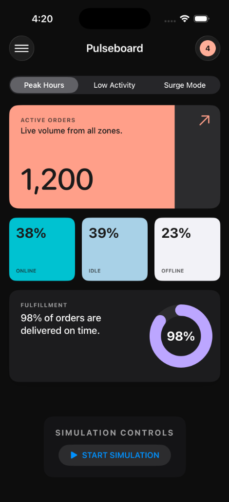
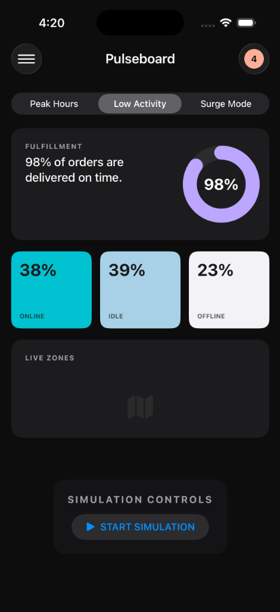
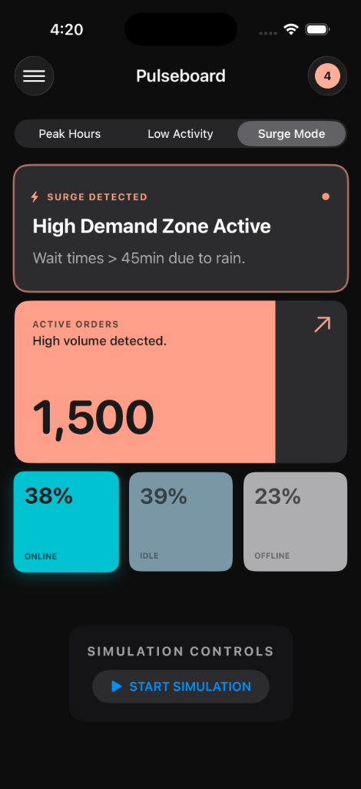

# Pulseboard: Intent-Driven Operations Dashboard

A SwiftUI prototype that dynamically adapts its UI based on real-time operational intent instead of static dashboards.

## Problem Statement

Traditional operations dashboards in food delivery and quick commerce suffer from a critical flaw: information density is static, but operational context is highly volatile.

During calm periods, operators are overwhelmed with irrelevant metrics. During high-pressure surges, critical signals are buried under noise. This lack of context awareness forces operators to mentally filter data, increasing cognitive load and slowing decision-making when speed is most critical.

## Core Insight

The user interface should not be a static grid of widgets. It should be a function of operational signals.

**UI = f(Operational Intent)**

By inferring the "intent" of the system (e.g., is it crumbling under load? is it a quiet afternoon?), the UI can automatically reconfigure itself to show only what matters for that specific moment.

## What Pulseboard Does

Pulseboard demonstrates an autonomous, self-adapting dashboard system that:

1.  **Ingests** raw operational signals (Active Orders, Wait Times, Fulfillment Rates).
2.  **Infers** the current operational intent (Peak, Low Activity, Surge).
3.  **Composes** the UI dynamically based on that intent.
4.  **Adapts** layout, hierarchy, and micro-interactions without manual intervention.

## Architecture Overview

The system strictly follows a unidirectional data flow, ensuring that UI changes are predictable consequences of data changes.

```
OpsSignal
    ↓
SurgeDetector
    ↓
IntentResolver
    ↓
PulseboardViewModel
    ↓
Intent-Driven SwiftUI Composition
```

### Components

*   **OpsSignal**: A pure data model representing a snapshot of the backend state. It contains raw metrics like `activeOrders`, `avgWaitTime`, and `uniqueDrivers`.
*   **SurgeDetector**: A pure logic component that analyzes trends between the current and previous signal. It uses heuristics (e.g., rising order trends combined with fulfillment degradation) to flag a "Surge" state.
*   **IntentResolver**: Maps the `OpsSignal` and surge status to a high-level `IntentMode`. This isolates business logic from UI logic.
*   **PulseboardViewModel**: The single source of truth for the View layer. It manages the simulation lifecycle and publishes state changes.
*   **SwiftUI Views**: Declarative views that use `@ViewBuilder` to compose themselves based on the current `IntentMode`.

## Intent Modes

The dashboard supports three distinct modes, each optimized for a specific operational reality:

1.  **Peak Mode**: Optimized for high throughput. Shows active order volume and fleet status prominently. Layout is balanced.
2.  **Low Activity Mode**: Optimized for analysis. Highlights secondary metrics like "Live Zones" and fulfillment efficiency, which are usually hidden during peak times.
3.  **Surge Mode**: Optimized for crisis management. The layout compresses to increase information density. Urgency is conveyed through specific micro-interactions (e.g., pulsing alerts, bold typography), and non-essential metrics are deprioritized.

## Surge Detection Logic

Surge is not triggered manually. It is detected automatically by the `SurgeDetector` when two or more of the following conditions are met:

*   **Rising Order Trend**: Current active orders exceed the previous snapshot.
*   **Critical Wait Times**: Average wait time exceeds 15 minutes.
*   **Fulfillment Degradation**: Fulfillment rate drops below 96%.
*   **High Volume**: Absolute order count exceeds 1000.

The system includes hysteresis to prevent rapid toggling. A surge will only resolve when the system stabilizes (Wait Time < 12m and Fulfillment > 97%).

## Live Signal Simulation

To demonstrate the intent-driven architecture, Pulseboard includes a `SignalSimulator` that runs an autonomous lifecycle loop:

1.  **Normal Phase**: Generates baseline data.
2.  **Ramping Phase**: Simulates a "Rush Hour" scenario where order volume spikes and wait times degrade.
3.  **Cooling Phase**: Simulates the recovery period.

Developers can observe the `SurgeDetector` identify the Ramping Phase and automatically switch the dashboard to Surge Mode, then resolve it during the Cooling Phase.

## Screenshots

| Peak Mode | Low Activity Mode | Surge Mode |
|----------|------------------|------------|
|  |  |  |

*Screenshots demonstrate how the same dashboard adapts dynamically based on operational intent.*

## Why This Matters

For companies like Swiggy, Zomato, or Zepto, internal operations tools are the nervous system of the business. A standard dashboard that treats "3 orders" and "3000 orders" with the same visual weight is a liability.

Intent-driven systems reduce the time to insight. By automating the "what should I look at?" decision, we allow operators to focus entirely on "what should I do?".

## Tradeoffs & Decisions

*   **No Networking**: The focus of this prototype is on state management and UI composition architecture, not API integration.
*   **Minimal UI Polish**: While the design system is consistent, the visual style is deliberately restrained to focus on behavior and hierarchy.
*   **Hardcoded Thresholds**: In a production system, surge thresholds would be dynamic, fetched from a remote configuration service based on city/zone tier.

## What Would Be Built Next

1.  **Backend Integration**: connect to a WebSocket stream for real-time `OpsSignal` ingestion.
2.  **Advanced Anomaly Detection**: Replace simple thresholds with statistical anomaly detection for more accurate surge flagging.
3.  **Historical Analysis**: Allow operators to "scrub" back in time to see the signals that led to a specific intent state.
4.  **Role-Based Layouts**: Adapt the intent derivation based on the logged-in user (e.g., Fleet Manager vs. Zone Manager).

## Closing

Pulseboard is an exploration of how intent-driven systems can reduce cognitive load and improve decision-making in high-pressure operational environments.
